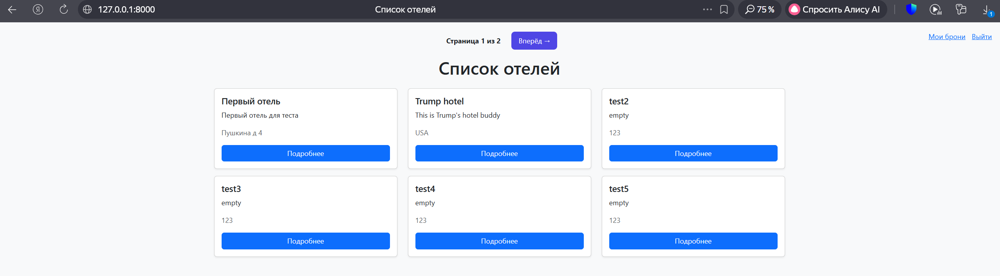
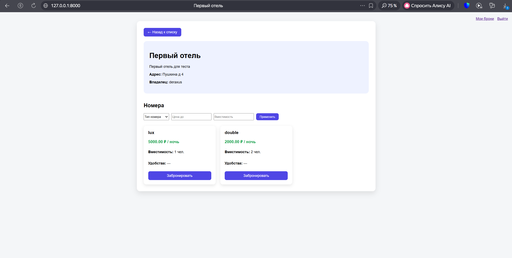
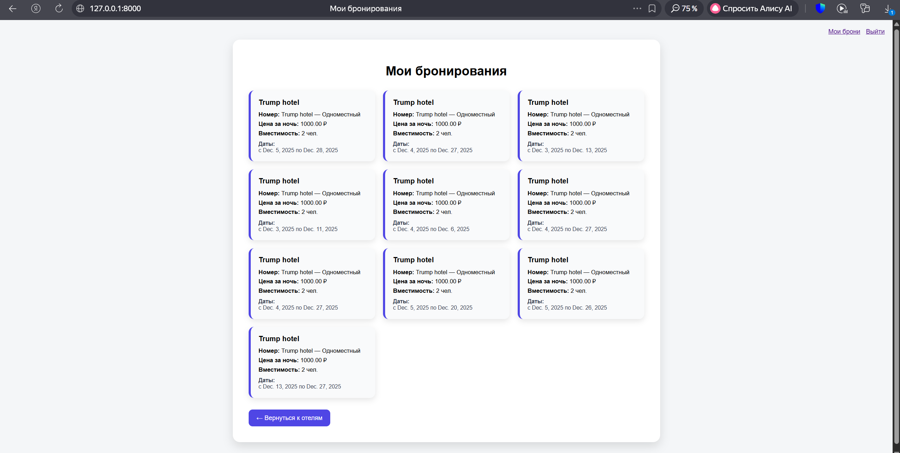
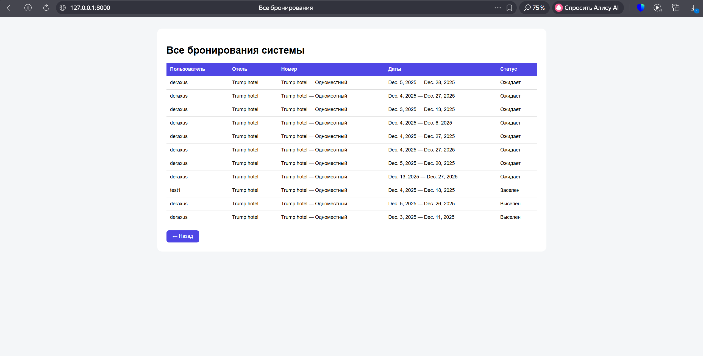

# Лабораторная работа №2  
Реализация веб сервиса средствами Django и PostgreSQL  

## Цель работы  
Изучить основы работы с Django, научиться создавать модели, настраивать базу данных PostgreSQL, реализовывать регистрацию пользователей, систему бронирования, а также разграничение прав между обычными пользователями и администратором.

## Вариант задания  
Вариант 1. Список отелей.

В системе хранится информация:
- название отеля  
- владелец  
- адрес  
- описание  
- номера  
- стоимость  
- вместимость  
- удобства  

Реализован следующий функционал:
- регистрация пользователей  
- просмотр отелей и номеров  
- бронирование номеров  
- просмотр своих бронирований  
- администратор управляет заселением и выселением  
- таблица всех бронирований за последний месяц  
- разграничение прав пользователя и администратора  

## Используемые технологии  
- Python 3  
- Django  
- PostgreSQL  
- HTML  
- CSS  
- Bootstrap  

---

## Структура базы данных  

В проекте используются следующие модели:

### Hotel  
Хранит информацию об отеле:
- название  
- описание  
- адрес  
- владелец  

### Room  
Хранит информацию о номерах:
- тип номера  
- цена за ночь  
- вместимость  
- удобства  
- связь с отелем  

### Booking  
Хранит данные о бронированиях:
- пользователь  
- номер  
- дата заезда  
- дата выезда  
- статус брони  
- дата создания  

Статусы бронирования:
- ожидает  
- заселен  
- выселен  
- отменено  

---

## Реализованный функционал  

### 1. Авторизация и работа с пользователями  
Пользователь может войти в систему через стандартную форму Django.  
Администратор создается через консоль и управляет бронированиями через админ-панель.

### 2. Просмотр списка отелей  
На главной странице отображается список всех отелей.  
Подключена пагинация, чтобы список делился на страницы.  
Работает фильтрация.

---

### 3. Просмотр информации об отеле и номерах  
При переходе в карточку отеля отображается:
- описание  
- адрес  
- владелец  
- список всех номеров  

Для каждого номера указана цена, вместимость и удобства.

---

### 4. Бронирование номера  
Авторизованный пользователь может забронировать номер, указав:
- дату заезда  
- дату выезда  

После создания бронирования данные сохраняются в базе.

---

### 5. Мои бронирования  
Пользователь может просматривать список своих бронирований.  
Каждая бронь отображается в виде карточки с датами и информацией о номере.

---

### 6. Разграничение прав  
Обычный пользователь:
- видит только свои бронирования  

Администратор:
- видит все бронирования  
- может изменять статус брони  
- может управлять заселением и выселением через админ-панель  

В интерфейсе кнопка "Все брони" доступна только администратору.

---

### 7. Таблица заселений за последний месяц  
Для администратора реализована таблица, которая показывает все бронирования за последний месяц.  
В таблице отображается:
- пользователь  
- номер  
- даты проживания  
- статус  

---

## Вывод  
В ходе выполнения лабораторной работы:
- был создан полноценный веб сервис на Django  
- подключена база данных PostgreSQL  
- реализована регистрация и авторизация  
- настроено бронирование номеров  
- реализовано разграничение прав между пользователем и администратором  
- добавлены пагинация и фильтрация  
- создан удобный пользовательский интерфейс  

